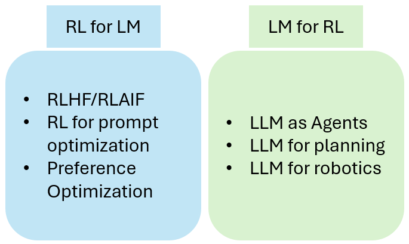

<figure>
    
</figure>

    <h1>Reinforcement Learning and Foundation Models</h1>

 

ICLR 2024 hybrid Workshop, May 7th, Vienna, Austria

<a href='mailto:rlfmworkshop@gmail.com'>rlfmworkshop@gmail.com</a>.

<!--<h3 style='margin-bottom: 10pt;'>Sponsors</h3>-->

<!--
-->
<!--	
-->
<!--This workshop is sponsored by:-->
<!--
-->
<!--  

-->
<!--  
and
-->
<!--  

-->
<!--
-->

    <h3 style='margin-bottom: 10pt;'>Description</h3>
    

        Reinforcement learning (RL) has long been proposed as a powerful paradigm for learning, from interaction, to solve sequential decision-making problems. Very recently, there has been a surge of work using RL to align large language models (LLMs) to human values through the paradigm of RL from human feedback (RLHF). Inspired by the idea of alignment through inverse reinforcement learning, these approaches use human preference data to learn a reward function approximating human values and use this reward to finetune LLMs with RL. RLHF has taken a step in helping solve the outstanding problems with language models by making them more similar to a conversational partner, more steerable, more relevant, and more aligned. Additionally, one can also see it the other way around: viewing instruction-following assistants as RL agents. These language-based models solve some of the problems of pure-RL agents such as the ability to flexibly multitask and use pretrained experience instead of being trained from scratch.
    

    

        The aim of this workshop is to provide a stage for researchers in this exciting field to define common challenges and questions, to exchange and consolidate best practices, and to push the advance of tools and benchmarks. As an indication, this workshop aims to make progress on the following open questions:
        <ul>
        <li>  What are the advantages of fine-tuning LLMs with RL compared to behavioral cloning/supervised learning, and on what tasks? </li>
        <li>  What are the recommended methods for training reward functions using human feedback? In what ways can various forms of feedback, such as preferences, demonstrations, and advice, be utilized? How can the quality of human feedback be assessed? </li>
        <li>  What approaches should be considered when training RLLM agents using pretrained LMs? This includes considerations for hyperparameters, reproducibility, algorithms, generation strategies, and the use of parameter-efficient fine-tuning. </li>
        <li>  How can RL be utilized to develop conversational AI that is capable of generating truthful responses? </li>
        <li>  Can RLLM agents effectively handle tasks in formal domains that involve automated checks for completion, such as mathematics (using a proof system) or programming (interacting with a compiler or interpreter)? </li>
        <li>  In what ways can game-playing agent techniques, such as self-play and multi-agent dynamics, be utilized to enhance the performance of RLLM agents? </li>
        </ul>

        The field is emerging, and we expect to formalize many other questions as the workshop takes place. The workshop will additionally aim at fostering discussions around the ethical implications of RLLM research (whose preferences are we optimizing?), as well as serve as a platform for the presentation of tools and frameworks that make training RLLM agents easier and more accessible to a wider community.
    

  

<h3 style='margin-bottom: 10pt;'>References</h3>

    <ul>
        <li>Rishabh Agarwal, Max Schwarzer, Pablo Samuel Castro, Aaron Courville, and Marc G Bellemare.
            Beyond tabula rasa: Reincarnating reinforcement learning. arXiv preprint arXiv:2206.01626, 2022.</li>
            
            <li>Michael Ahn, Anthony Brohan, Noah Brown, Yevgen Chebotar, Omar Cortes, Byron David, Chelsea
            Finn, Keerthana Gopalakrishnan, Karol Hausman, Alex Herzog, Daniel Ho, Jasmine Hsu, Julian
            Ibarz, Brian Ichter, Alex Irpan, Eric Jang, Rosario Jauregui Ruano, Kyle Jeffrey, Sally Jesmonth,
            Nikhil J. Joshi, Ryan Julian, Dmitry Kalashnikov, Yuheng Kuang, Kuang-Huei Lee, Sergey
            Levine, Yao Lu, Linda Luu, Carolina Parada, Peter Pastor, Jornell Quiambao, Kanishka Rao, Jarek
            Rettinghouse, Diego Reyes, Pierre Sermanet, Nicolas Sievers, Clayton Tan, Alexander Toshev,
            Vincent Vanhoucke, Fei Xia, Ted Xiao, Peng Xu, Sichun Xu, and Mengyuan Yan. Do as i can, not
            as i say: Grounding language in robotic affordances. 2022. URL http://arxiv.org/abs/2204.01691.</li>
            
            <li>Arnav Arora, Lucie-Aimée Kaffee, and Isabelle Augenstein. Probing pre-trained language models
            for cross-cultural differences in values. (arXiv:2203.13722), 2022. URL http://arxiv.org/abs/2203.
            1.     type: article.</li>
            
            <li>Christopher Berner, Greg Brockman, Brooke Chan, Vicki Cheung, Przemysław D ̨ebiak, Christy
            Dennison, David Farhi, Quirin Fischer, Shariq Hashme, Chris Hesse, et al. Dota 2 with large scale
            deep reinforcement learning. arXiv preprint arXiv:1912.06680, 2019.</li>
            
            <li>Kevin Black, Michael Janner, Yilun Du, Ilya Kostrikov, and Sergey Levine. Training diffusion models
            with reinforcement learning, 2023.</li>
            
            <li>Rishi Bommasani, Drew A. Hudson, Ehsan Adeli, Russ B. Altman, Simran Arora, Sydney von Arx,
            Michael S. Bernstein, Jeannette Bohg, Antoine Bosselut, Emma Brunskill, Erik Brynjolfsson,
            Shyamal Buch, Dallas Card, Rodrigo Castellon, Niladri S. Chatterji, Annie S. Chen, Kathleen
            Creel, Jared Quincy Davis, Dorottya Demszky, Chris Donahue, Moussa Doumbouya, Esin Durmus,
            Stefano Ermon, John Etchemendy, Kawin Ethayarajh, Li Fei-Fei, Chelsea Finn, Trevor Gale,
            Lauren Gillespie, Karan Goel, Noah D. Goodman, Shelby Grossman, Neel Guha, Tatsunori
            Hashimoto, Peter Henderson, John Hewitt, Daniel E. Ho, Jenny Hong, Kyle Hsu, Jing Huang,
            Thomas Icard, Saahil Jain, Dan Jurafsky, Pratyusha Kalluri, Siddharth Karamcheti, Geoff Keeling,
            Fereshte Khani, Omar Khattab, Pang Wei Koh, Mark S. Krass, Ranjay Krishna, Rohith Kuditipudi,
            and et al. On the opportunities and risks of foundation models. CoRR, abs/2108.07258, 2021. URL
            https://arxiv.org/abs/2108.07258.</li>
            
            <li>Tom Brown, Benjamin Mann, Nick Ryder, Melanie Subbiah, Jared D Kaplan, Prafulla Dhariwal,
            Arvind Neelakantan, Pranav Shyam, Girish Sastry, Amanda Askell, et al. Language models are
            few-shot learners. Advances in neural information processing systems, 33:1877–1901, 2020.
            CarperAI. Transformer reinforcement learning x. https://github.com/CarperAI/trlx, 2022.</li>
            
            <li>Thomas Carta, Clément Romac, Thomas Wolf, Sylvain Lamprier, Olivier Sigaud, and Pierre-Yves
            Oudeyer. Grounding large language models in interactive environments with online reinforcement
            learning. arXiv preprint arXiv:2302.02662, 2023.</li>
            
            <li>Marc-Alexandre Côté, Akos Kádár, Xingdi Yuan, Ben Kybartas, Tavian Barnes, Emery Fine, James
            Moore, Matthew Hausknecht, Layla El Asri, Mahmoud Adada, et al. Textworld: A learning
            environment for text-based games. In Computer Games: 7th Workshop, CGW 2018, Held in Con-
            junction with the 27th International Conference on Artificial Intelligence, IJCAI 2018, Stockholm,
            Sweden, July 13, 2018, Revised Selected Papers 7, pp. 41–75. Springer, 2019.</li>
            
            <li>Alexey Dosovitskiy, Lucas Beyer, Alexander Kolesnikov, Dirk Weissenborn, Xiaohua Zhai, Thomas
            Unterthiner, Mostafa Dehghani, Matthias Minderer, Georg Heigold, Sylvain Gelly, et al. An
            image is worth 16x16 words: Transformers for image recognition at scale. arXiv preprint
            arXiv:2010.11929, 2020.</li>
            
            <li>Dylan Hadfield-Menell, Stuart J Russell, Pieter Abbeel, and Anca Dragan. Cooperative inverse
            reinforcement learning. Advances in neural information processing systems, 29, 2016.</li>
            
            <li>Peter Henderson, Riashat Islam, Philip Bachman, Joelle Pineau, Doina Precup, and David Meger.
            Deep reinforcement learning that matters. In Proceedings of the AAAI conference on artificial
            intelligence, volume 32, 2018.</li>
            
            <li>Daniel Hershcovich, Stella Frank, Heather Lent, Miryam de Lhoneux, Mostafa Abdou, Stephanie
            Brandl, Emanuele Bugliarello, Laura Cabello Piqueras, Ilias Chalkidis, Ruixiang Cui, Constanza
            Fierro, Katerina Margatina, Phillip Rust, and Anders Søgaard. Challenges and strategies in
            cross-cultural NLP. 2022. URL http://arxiv.org/abs/2203.10020.</li>
            
            <li>Jordan Hoffmann, Sebastian Borgeaud, Arthur Mensch, Elena Buchatskaya, Trevor Cai, Eliza Ruther-
            ford, Diego de Las Casas, Lisa Anne Hendricks, Johannes Welbl, Aidan Clark, et al. Training
            compute-optimal large language models. arXiv preprint arXiv:2203.15556, 2022.</li>
            
            <li>Edward J Hu, Yelong Shen, Phillip Wallis, Zeyuan Allen-Zhu, Yuanzhi Li, Shean Wang, Lu Wang,
            and Weizhu Chen. Lora: Low-rank adaptation of large language models. arXiv preprint
            arXiv:2106.09685, 2021.</li>
            
            <li>Wenlong Huang, Pieter Abbeel, Deepak Pathak, and Igor Mordatch. Language models as zero-shot
            planners: Extracting actionable knowledge for embodied agents. URL http://arxiv.org/abs/2201.07207.</li>
            
            <li>Wenlong Huang, Fei Xia, Ted Xiao, Harris Chan, Jacky Liang, Pete Florence, Andy Zeng, Jonathan
            Tompson, Igor Mordatch, Yevgen Chebotar, Pierre Sermanet, Noah Brown, Tomas Jackson, Linda
            Luu, Sergey Levine, Karol Hausman, and Brian Ichter. (arXiv:2207.05608), 2022. URL http://arxiv.org/abs/2207.05608.</li>
            
            <li>Jared Kaplan, Sam McCandlish, Tom Henighan, Tom B Brown, Benjamin Chess, Rewon Child, Scott
            Gray, Alec Radford, Jeffrey Wu, and Dario Amodei. Scaling laws for neural language models.
            arXiv preprint arXiv:2001.08361, 2020.</li>
            
            <li>Hung Le, Yue Wang, Akhilesh Deepak Gotmare, Silvio Savarese, and Steven Chu Hong Hoi. Coderl:
            Mastering code generation through pretrained models and deep reinforcement learning. Advances
            in Neural Information Processing Systems, 35:21314–21328, 2022.</li>
            
            <li>Jacky Liang, Wenlong Huang, Fei Xia, Peng Xu, Karol Hausman, Brian Ichter, Pete Florence, and
            Andy Zeng. Code as policies: Language model programs for embodied control. (arXiv:2209.07753), URL http://arxiv.org/abs/2209.07753.</li>
            
            <li>Jessy Lin, Yuqing Du, Olivia Watkins, Danijar Hafner, Pieter Abbeel, Dan Klein, and Anca Dragan.
            Learning to model the world with language. 2023. URL https://arxiv.org/abs/2308.01399.</li>
            
            <li>Haotian Liu, Chunyuan Li, Qingyang Wu, and Yong Jae Lee. Visual instruction tuning, 2023.</li>
            
            <li>Long Ouyang, Jeffrey Wu, Xu Jiang, Diogo Almeida, Carroll Wainwright, Pamela Mishkin, Chong
            Zhang, Sandhini Agarwal, Katarina Slama, Alex Ray, et al. Training language models to follow
            instructions with human feedback. Advances in Neural Information Processing Systems, 35:
            27730–27744, 2022.</li>
            
            <li>André Susano Pinto, Alexander Kolesnikov, Yuge Shi, Lucas Beyer, and Xiaohua Zhai. Tuning
            computer vision models with task rewards. arXiv preprint arXiv:2302.08242, 2023.</li>
            
            <li>Alec Radford, Jong Wook Kim, Chris Hallacy, Aditya Ramesh, Gabriel Goh, Sandhini Agarwal,
            Girish Sastry, Amanda Askell, Pamela Mishkin, Jack Clark, et al. Learning transferable visual
            models from natural language supervision. In International conference on machine learning, pp.
            8748–8763. PMLR, 2021.</li>
            
            <li>Rajkumar Ramamurthy, Prithviraj Ammanabrolu, Kianté Brantley, Jack Hessel, Rafet Sifa, Christian
            Bauckhage, Hannaneh Hajishirzi, and Yejin Choi. Is reinforcement learning (not) for natural
            language processing?: Benchmarks, baselines, and building blocks for natural language policy
            optimization. 2022. URL https://arxiv.org/abs/2210.01241.</li>
            
            <li>David Silver, Thomas Hubert, Julian Schrittwieser, Ioannis Antonoglou, Matthew Lai, Arthur Guez,
            Marc Lanctot, Laurent Sifre, Dharshan Kumaran, Thore Graepel, et al. Mastering chess and shogi
            by self-play with a general reinforcement learning algorithm. arXiv preprint arXiv:1712.01815,
            2017.</li>
            
            <li>David Silver, Satinder Singh, Doina Precup, and Richard S. Sutton. Reward is enough. Artificial
            Intelligence, 299:103535, 2021. ISSN 0004-3702. doi: https://doi.org/10.1016/j.artint.2021.103535.
            URL https://www.sciencedirect.com/science/article/pii/S0004370221000862.</li>
            
            <li>Nisan Stiennon, Long Ouyang, Jeffrey Wu, Daniel Ziegler, Ryan Lowe, Chelsea Voss, Alec Radford,
            Dario Amodei, and Paul F Christiano. Learning to summarize with human feedback. Advances in
            Neural Information Processing Systems, 33:3008–3021, 2020.</li>
            
            <li>Zhiqing Sun, Sheng Shen, Shengcao Cao, Haotian Liu, Chunyuan Li, Yikang Shen, Chuang Gan,
            Liang-Yan Gui, Yu-Xiong Wang, Yiming Yang, Kurt Keutzer, and Trevor Darrell. Aligning large
            multimodal models with factually augmented rlhf, 2023.</li>
            
            <li>Oriol Vinyals, Igor Babuschkin, Wojciech M. Czarnecki, Michaël Mathieu, Andrew Dudzik, Junyoung
            Chung, David H. Choi, Richard Powell, Timo Ewalds, Petko Georgiev, Junhyuk Oh, Dan Horgan,
            Manuel Kroiss, Ivo Danihelka, Aja Huang, Laurent Sifre, Trevor Cai, John P. Agapiou, Max
            Jaderberg, Alexander S. Vezhnevets, Rémi Leblond, Tobias Pohlen, Valentin Dalibard, David
            Budden, Yury Sulsky, James Molloy, Tom L. Paine, Caglar Gulcehre, Ziyu Wang, Tobias Pfaff,
            Yuhuai Wu, Roman Ring, Dani Yogatama, Dario Wünsch, Katrina McKinney, Oliver Smith,
            Tom Schaul, Timothy Lillicrap, Koray Kavukcuoglu, Demis Hassabis, Chris Apps, and David
            Silver. Grandmaster level in starcraft ii using multi-agent reinforcement learning. Nature, 575
            (7782):350–354, Nov 2019. ISSN 1476-4687. doi: 10.1038/s41586-019-1724-z. URL https://doi.org/10.1038/s41586-019-1724-z.</li>
            
            <li>Leandro von Werra, Younes Belkada, Lewis Tunstall, Edward Beeching, Tristan Thrush, and Nathan
            Lambert. Trl: Transformer reinforcement learning. https://github.com/lvwerra/trl, 2020.</li>
            
            <li>Daniel M Ziegler, Nisan Stiennon, Jeffrey Wu, Tom B Brown, Alec Radford, Dario Amodei, Paul
            Christiano, and Geoffrey Irving. Fine-tuning language models from human preferences. arXiv
            preprint arXiv:1909.08593, 2019.</li>
    </ul>

